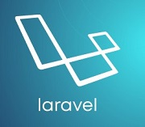

#### My simple laravel app  made in order to try and practice with it.

### [_extView_](http://extview.herokuapp.com/) Let's check your web-page.

~~~
1. $ git clone git@github.com:GaiPalyan/extView.git
2. $ make setup
3. $ make migrate
4. $ make start
~~~

===================================

#### Test and linter status:

